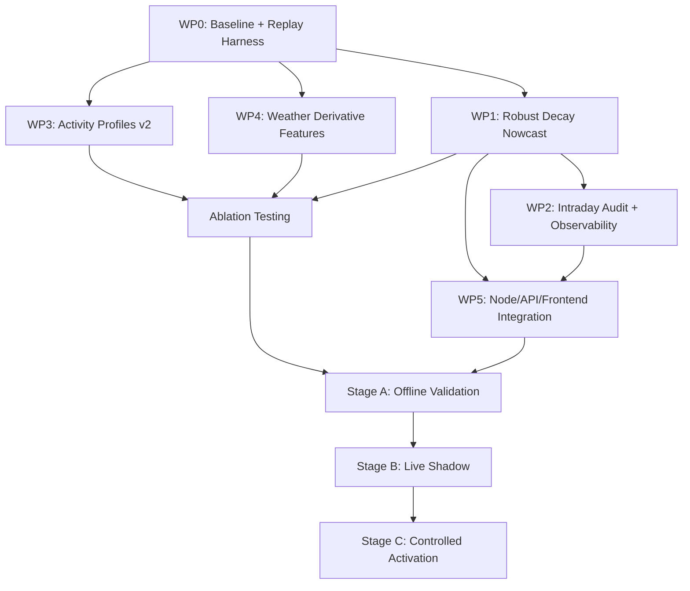

# Virtual Nowcasting & ML Upgrades — Detailed Implementation Plan

**Date:** 2026-08-20
**Status:** **Remediation Complete; Implementation verified green (All 12 evaluation findings resolved); gated behind `forecastVirtualNowcastMode=off` for operational shadow window**
**Scope:** Forecast service, forecast persistence/audit, analytics API/UI, tests, documentation, release packaging

## Latest remediation status (2026-08-21 12:47 UTC+08:00)

This status supersedes earlier language in this plan. All 12 evaluation findings
and remediation items have been resolved and verified across Python and Node.js
test suites. Production rollout remains safely default-`off` (`forecastVirtualNowcastMode=off`).

Implemented, remediated, and fully verified:

- Deployment-safe build identity, baseline snapshot CLI, and PyInstaller resource bundling (`test_forecast_build_identity.py`, 24 passed).
- Exact solar-window-relative shadow checkpoint extraction and audit storage (`+5/+15/+30/+60/+120` min and remaining-day P10/P50/P90 totals).
- Exact `series_run_id` correlation between persisted forecast series and intraday audit records.
- Complete API `/api/analytics/dayahead-chart` contract returning `ml_final.meta` structured diagnostics and frontend `<details>` accessibility.
- Immutable issue-time day-ahead replay loading with future constraint masking and metric aggregation (mean & median WAPE/MAE/RMSE).
- Robust activity-v2 profile generation with per-slot presence checks, NaN suppression, and strict `training_cutoff_date < target_date` artifact validation.
- Atomic `.tmp` artifact writer with strict schema and cutoff validation before file replacement.
- 30-second execution deadline (`_run_with_timeout`), top-level exception fallback, and physical cap constraints (`0 <= P10 <= P50 <= P90 <= slot_cap`).
- UI palette bug fixes (`pal.solcastEst`), dataset deterministic IDs (`ds.id`), and theme-switch legend rebuilds.
- Non-mutating user-guide PDF provenance sidecar and verification (`scripts/_gen_userguide_pdf.js --check`).
- Zero git whitespace errors (`git diff --check` clean).

Deliberately not promoted:

- The capacity-weighted activity profile is stored as an experimental schema-v2 artifact but is not used by production inference.
- Weather derivatives are generated as candidates but are not appended to `FEATURE_COLS`.
- `forecastVirtualNowcastMode` defaults to `off` until replay and live-shadow promotion gates pass.

The local evidence audit found 10 distinct `energy_5min` days and 18 forecast
issue-time snapshots. A 45-day artifact dry-run found 12 otherwise usable
history days, but only one day passed the new per-inverter activity-v2
acceptance rules. These remain evidence gates in addition to the implementation
and release blockers above; they do not excuse those blockers.

---

## 1. Goal

Upgrade the existing intraday forecast adjustment pipeline to a **robust, lead-time-decaying nowcast correction** while preserving the day-ahead forecast authority, existing data structures, and production stability. The work extends — never replaces — the existing intraday path.

### What the dashboard already does

| Capability | Existing implementation |
|---|---|
| ML/Solcast day-ahead forecast | [`run_dayahead()`](file:///d:/ADSI-Dashboard/services/forecast_engine.py#L10318-L10339) generates 5-min P10/P50/P90 for the target day |
| Intraday adjusted forecast | [`build_intraday_adjusted_forecast()`](file:///d:/ADSI-Dashboard/services/forecast_engine.py#L10173-L10289) computes a linear recent/global ratio correction every 5 min |
| Operational constraint exclusion | Cap-dispatch mask, 1000H alarm-based outage mask, export curtailment detection |
| Activity onset/offset modeling | [`estimate_activity_window()`](file:///d:/ADSI-Dashboard/services/forecast_engine.py#L6851-L6929), [`apply_activity_hysteresis()`](file:///d:/ADSI-Dashboard/services/forecast_engine.py#L6948-L6989), [`apply_block_staging()`](file:///d:/ADSI-Dashboard/services/forecast_engine.py#L6991-L7050) |
| Forecast artifact pipeline | [`build_forecast_artifacts()`](file:///d:/ADSI-Dashboard/services/forecast_engine.py#L6322-L6365) produces `activity_records` from `collect_history_days()` |
| Analytics chart API | [`/api/analytics/dayahead-chart`](file:///d:/ADSI-Dashboard/server/index.js#L22327) returns `locked`, `intraday_solcast`, `plant_actual`, `ml_final` |
| Feature matrix | [`build_features()`](file:///d:/ADSI-Dashboard/services/forecast_engine.py#L2425-L2772) with 70 features in [`FEATURE_COLS`](file:///d:/ADSI-Dashboard/services/forecast_engine.py#L2774-L2798) |
| Service loop scheduling | [`main()`](file:///d:/ADSI-Dashboard/services/forecast_engine.py#L11930-L12032) runs `run_intraday_adjusted(today)` every 5-min slot during SOLAR_START_H–SOLAR_END_H |

### What this upgrade achieves

1. **Replace the linear ratio adjustment** in `build_intraday_adjusted_forecast()` with a robust, log-space, lead-time-decaying nowcast correction.
2. **Extend the activity artifact** with capacity-weighted inverter synchronization profiles.
3. **Add weather derivative features** only after ablation testing proves they add real skill.
4. **Render the ML intraday result** as a distinct chart series with nowcast diagnostics.

---

## 2. Non-Negotiable Architecture Rules

### 2.1 Forecast authority

- **Node** owns provider selection, Solcast refresh decisions, day-ahead orchestration, freshness classification, and authoritative day-ahead audit creation.
- **Python** owns ML training, day-ahead ML execution, intraday correction, replay, QA, and model/artifact generation.
- [`forecast_dayahead`](file:///d:/ADSI-Dashboard/server/db.js#L835-L847) remains untouched by intraday generation.
- [`forecast_run_audit`](file:///d:/ADSI-Dashboard/server/db.js#L885-L922) remains the day-ahead run ledger. Intraday runs must never become authoritative learning rows in that table.

### 2.2 Actual-energy authority

Live nowcasting must use **server-side PAC × elapsed-time integration only**:

- **Primary live basis:** [`load_actual_loss_adjusted_with_presence()`](file:///d:/ADSI-Dashboard/services/forecast_engine.py#L3873-L3889) — this is already what `build_intraday_adjusted_forecast()` uses.
- **Forbidden as live observation:** Solcast `est_actual` or any Python/Modbus kWh register.
- [`resolve_actual_5min_for_date()`](file:///d:/ADSI-Dashboard/services/forecast_engine.py#L3396-L3470) must NOT be used for live nowcasting because its Step 3 fills missing slots with Solcast estimated actuals.

### 2.3 Operating modes

- Generation, artifact rebuilding, shadow evaluation, and intraday writes run in **`gateway` mode only**.
- `remote` remains a viewer and proxies forecast/analytics requests to the gateway.
- No new remote-side persistence of live forecast rows is allowed.

### 2.4 Scheduling

- Keep the existing Python service loop as the only regular intraday scheduler.
- Continue evaluating the current day once per 5-min slot during [`SOLAR_START_H`–`SOLAR_END_H`](file:///d:/ADSI-Dashboard/services/forecast_engine.py#L12001-L12009) (05:00–18:00).
- Do not add Node cron jobs; they would duplicate the existing writer.

### 2.5 Backward compatibility

- Existing model bundles must continue to load via [`_align_bundle_features()`](file:///d:/ADSI-Dashboard/services/forecast_engine.py#L8038).
- Existing `forecast_intraday_adjusted` readers and replication behavior must keep working during upgrade and rollback.
- The legacy JSON forecast context remains a compatibility fallback; SQLite remains authoritative.
- All new artifact formats require a `schema_version` and safe fallback when missing/stale/corrupt.

---

## 3. Forecast Product Definitions

| Product | Source | Table/Key | Mutability |
|---|---|---|---|
| Locked day-ahead P10/P50/P90 | Node: `getDayAheadLockedForDay()` | `dayahead_locked_snapshots` | First-write-wins |
| ML day-ahead | Python: `run_dayahead()` → `write_forecast("PacEnergy_DayAhead", ...)` | `forecast_dayahead` | Replaceable via audited generation |
| Plant actual | PAC-integrated `energy_5min` | `load_actual_loss_adjusted_with_presence()` | Appended as observations arrive |
| Solcast estimated actual | Satellite provider snapshot | `solcast_snapshots.est_actual_mw` | Provider overwrite semantics |
| **ML intraday nowcast** | Python: `build_intraday_adjusted_forecast()` → `write_forecast("PacEnergy_IntradayAdjusted", ...)` | `forecast_intraday_adjusted` | Refreshed each eligible 5-min slot |

Frontend label `Solcast est. actual` continues to mean Solcast estimated actual. The new/updated line must be labeled `ML intraday nowcast` and consume the API's `ml_final` payload.

---

## 4. Work Package 0 — Baseline & Replay Harness

> [!IMPORTANT]
> No model or production behavior changes begin until a reproducible baseline and replay harness exist.

### 4.1 Freeze the comparison baseline

Record a snapshot of:

- Package version and git commit hash
- Active model bundle checksum and feature names from [`FEATURE_COLS`](file:///d:/ADSI-Dashboard/services/forecast_engine.py#L2774-L2798) (currently 70 features)
- Active forecast artifact versions (created_ts, lookback_days from [`build_forecast_artifacts()`](file:///d:/ADSI-Dashboard/services/forecast_engine.py#L6322-L6365))
- Operator forecast settings: `forecastIntradayBlendMax` and any other `_setting_float_or_none` / `_setting_bool_or_default` values
- Current intraday algorithm constants:
  - [`INTRADAY_MIN_OBS_SLOTS = 6`](file:///d:/ADSI-Dashboard/services/forecast_engine.py#L336)
  - [`INTRADAY_MAX_OBS_SLOTS = 36`](file:///d:/ADSI-Dashboard/services/forecast_engine.py#L337)
  - [`INTRADAY_RATIO_CLIP = (0.65, 1.35)`](file:///d:/ADSI-Dashboard/services/forecast_engine.py#L338)
  - [`INTRADAY_RECENT_RATIO_CLIP = (0.55, 1.35)`](file:///d:/ADSI-Dashboard/services/forecast_engine.py#L339)
  - [`INTRADAY_BLEND_MAX = 0.72`](file:///d:/ADSI-Dashboard/services/forecast_engine.py#L340)
- Training-day/sample counts and weather-regime distribution from the Solcast reliability artifact
- Solcast/provider configuration class (without credentials)

Output: JSON baseline snapshot saved to `forecast/baseline_snapshot.json`.

### 4.2 Implement intraday replay mode

Create a non-persistent replay function that evaluates historical issue times without overwriting live rows or audits.

#### 4.2.1 New function: `replay_intraday_nowcast()`

```python
def replay_intraday_nowcast(
    target_date: date,
    simulated_cutoff_slot: int,
    challenger_algo: str = "robust_decay",  # "current" | "robust_decay" | "activity_v2" | "combined"
    persist: bool = False,
) -> dict:
```

For every replayed target date and simulated issuance time:

1. Load the day-ahead forecast that was available at that historical time via [`load_dayahead_with_presence(day_s)`](file:///d:/ADSI-Dashboard/services/forecast_engine.py#L10175).
2. Load actuals via [`load_actual_loss_adjusted_with_presence(day_s)`](file:///d:/ADSI-Dashboard/services/forecast_engine.py#L3873) — expose only actual slots whose timestamps are at or before `simulated_cutoff_slot`.
3. **Exclude future actuals** even though they exist in the historical DB.
4. **Exclude Solcast estimated actuals** from the observation and scoring basis — do NOT call `resolve_actual_5min_for_date()`.
5. Apply the same constraint masks as production:
   - `_build_1000h_inverter_outage_mask(day_s)` (inverter outage)
   - `build_operational_constraint_mask(day_s)` → `cap_dispatch_mask`
   - `curtailed_mask(actual, dayahead)` (export curtailment)
6. Score only future horizons relative to the simulated issuance time.

#### 4.2.2 Required replay horizons

- +5 min, +15 min, +30 min, +60 min, +120 min
- Remaining-day total energy

#### 4.2.3 Replay metrics per horizon

- MAE, WAPE, RMSE
- Total-energy APE for remaining-day
- Improvement vs. unchanged day-ahead (percentage)
- Improvement vs. current intraday algorithm (percentage)

### 4.3 Champion/challenger framework

Every replay run must compare these algorithms:

| Variant | Description |
|---|---|
| `unchanged_dayahead` | Raw day-ahead, no intraday correction |
| `current` | Existing [`build_intraday_adjusted_forecast()`](file:///d:/ADSI-Dashboard/services/forecast_engine.py#L10173-L10289) logic |
| `robust_decay` | New log-space, lead-time-decaying nowcast (WP1) |
| `activity_v2` | Capacity-weighted activity profile challenger (WP3) |
| `weather_deriv` | Weather derivative features model (WP4) |
| `combined` | All passing components together — only after individual ablations pass |

#### 4.3.1 Replay output format

Persist replay results to a dedicated experiment output file (NOT the live forecast tables):

```python
{
    "replay_id": "<uuid>",
    "baseline_commit": "<git-hash>",
    "target_date": "YYYY-MM-DD",
    "simulated_cutoff_slot": 156,
    "algorithm_version": "robust_decay_v1",
    "variants": {
        "unchanged_dayahead": { "mae_5m": ..., "wape_15m": ..., ... },
        "current": { ... },
        "robust_decay": { ... },
    },
    "actual_provenance": "pac_loss_adjusted",
    "constraint_masks": {
        "cap_dispatch_slots": 3,
        "outage_slots": 0,
        "curtailed_slots": 2,
    },
    "feature_versions": { "FEATURE_COLS_count": 70, "artifact_created_ts": ... },
}
```

Save to: `forecast/replay_results/replay_{date}_{cutoff}.json`

### 4.4 CLI entry point for replay

Extend the existing [`parse_cli_args()`](file:///d:/ADSI-Dashboard/services/forecast_engine.py#L12027) / [`run_cli_generation()`](file:///d:/ADSI-Dashboard/services/forecast_engine.py#L12028) to support:

```
python forecast_engine.py --replay --from-date 2026-06-01 --to-date 2026-08-01 --horizons 5,15,30,60,120 --variants current,robust_decay --dry-run
```

---

## 5. Work Package 1 — Robust Lead-Time-Decaying Nowcast

### 5.1 Implementation location

Refactor and extend [`build_intraday_adjusted_forecast()`](file:///d:/ADSI-Dashboard/services/forecast_engine.py#L10173-L10289) and [`run_intraday_adjusted()`](file:///d:/ADSI-Dashboard/services/forecast_engine.py#L10291-L10312). Do not create a parallel scheduler or a second production table.

### 5.2 Current algorithm analysis (what we're replacing)

The existing code at [lines 10173–10289](file:///d:/ADSI-Dashboard/services/forecast_engine.py#L10173-L10289) does:

1. Loads day-ahead and loss-adjusted actuals
2. Builds constraint masks (1000H outage, cap-dispatch, export curtailment)
3. Cascading fallback for observation quality:
   - `unconstrained_mask` → `cap_free_mask` → `fallback_mask` (all-observed)
4. Computes a **global ratio** (`actual_total / dayahead_total`) over up to 36 observed solar slots
5. Computes a **recent ratio** over the last 12 observed slots
6. Calculates `strength = min(blend_max, 0.24 + 0.02 * len(observed_slots))`
7. For future slots: linear fade from `recent_ratio` → `global_ratio` over 24 steps
8. Applies `factor = 1.0 + strength * (target_ratio - 1.0)` to each future day-ahead slot
9. Enforces ±320 kWh slot-to-slot ramp limit
10. Generates confidence bands via `confidence_bands()`

**Problems with current approach:**
- Linear ratio space is asymmetric (50% undershoot ≠ 200% overshoot)
- Single-slot spikes can dominate (no robust estimator)
- Fixed 24-step linear fade has no physical basis
- Cascading fallback to contaminated observation sets happens silently
- No lead-time-dependent decay

### 5.3 Eligible observations (new logic)

An observed slot is eligible only when **ALL** conditions are true:

1. PAC-integrated actual is present (from `load_actual_loss_adjusted_with_presence()`, `actual_present_arr[slot] == True`)
2. The slot index ≤ current/replay cutoff slot
3. Day-ahead baseline energy exceeds `MIN_BASELINE_ENERGY` (e.g., 5 kWh per slot) — prevents unstable ratios from tiny denominators
4. The slot is within the solar window: `SOLAR_START_SLOT` to `SOLAR_END_SLOT` (currently slots 60–216)
5. The slot is NOT cap-dispatch constrained (`cap_dispatch_mask[slot] == False`)
6. The slot is NOT covered by inverter outage (`inverter_outage_mask[slot] == False`)
7. The slot is NOT export-curtailed (`curtailed_mask[slot] == False`)
8. Enough plant capacity was observable (from ipconfig: at least 70% of configured inverters reporting)

> [!IMPORTANT]
> The current cascading fallback (lines 10210–10221) that falls from unconstrained → cap-free → all-observed **must be removed**. A nowcast should fall back to unchanged day-ahead rather than silently learn from constrained slots.

### 5.4 Robust correction calculation

For each eligible observed slot `i`:

```
r_i = log(max(actual_i, epsilon) / max(dayahead_i, epsilon))
```

Where `epsilon = 0.1` kWh (safe denominator floor).

Compute:
- **`b_recent`**: weighted median of `r_i` over the most recent 6–12 eligible slots (recency-weighted)
- **`b_session`**: weighted median of `r_i` over the most recent up to 36 eligible slots
- **`strength`**: bounded confidence factor derived from:
  - eligible slot count (min 6 to activate)
  - baseline energy level
  - observed-capacity coverage (% of configured inverters reporting)
  - source quality (all PAC-integrated)
  - ratio volatility (std of recent log ratios)
  - capped by operator-tunable [`forecastIntradayBlendMax`](file:///d:/ADSI-Dashboard/services/forecast_engine.py#L10242-L10243)

For future lead time `h` minutes:

```
short_weight(h) = exp(-ln(2) * h / half_life_minutes)
bias(h)         = strength * short_weight(h) * ((1 - recent_mix) * b_session + recent_mix * b_recent)
factor(h)       = clip(exp(bias(h)), ratio_floor, ratio_ceiling)
nowcast(h)      = clip(dayahead(h) * factor(h), 0, physical_slot_cap)
```

#### 5.4.1 New constants to add

```python
# Nowcast correction (robust decay)
NOWCAST_MIN_BASELINE_ENERGY   = 5.0    # kWh per slot minimum denominator
NOWCAST_LOG_RATIO_EPSILON     = 0.1    # kWh floor for log ratio calculation
NOWCAST_HALF_LIFE_MINUTES     = 45.0   # initial value — tuned via replay
NOWCAST_RECENT_MIX            = 0.55   # blend between recent and session bias
NOWCAST_RATIO_FLOOR           = 0.55   # exp(bias) minimum
NOWCAST_RATIO_CEILING         = 1.50   # exp(bias) maximum
NOWCAST_MIN_CAPACITY_COVERAGE = 0.70   # fraction of configured inverters required
NOWCAST_VOLATILITY_DAMP       = 0.85   # strength multiplier when volatility is high
```

#### 5.4.2 Weighted median implementation

```python
def _weighted_median(values: np.ndarray, weights: np.ndarray) -> float:
    """Robust weighted median of log ratios."""
    sorted_idx = np.argsort(values)
    sorted_vals = values[sorted_idx]
    sorted_weights = weights[sorted_idx]
    cumsum = np.cumsum(sorted_weights)
    median_idx = np.searchsorted(cumsum, cumsum[-1] / 2.0)
    return float(sorted_vals[min(median_idx, len(sorted_vals) - 1)])
```

### 5.5 Time gating

Do NOT hardcode a new 08:00–16:00 operating window. The service continues running during 05:00–18:00 (`SOLAR_START_H`–`SOLAR_END_H`), but correction eligibility is controlled by the evidence-based gates in §5.3:

- Minimum baseline energy naturally excludes shoulder slots with tiny denominators
- Minimum eligible observation count (6 slots) prevents premature correction
- Volatility damping reduces correction strength when ratios are unstable

This permits useful early/late corrections when evidence is good and naturally falls back when shoulder ratios are unstable.

### 5.6 Past slots and confidence bands

- Past observed slots in `forecast_intraday_adjusted` remain actual observations (unchanged from current behavior at [line 10228](file:///d:/ADSI-Dashboard/services/forecast_engine.py#L10228))
- Future P50 slots use the nowcast formula above
- Future P10/P90: transform consistently with the point forecast, then widen for horizon-dependent uncertainty:
  ```
  P10(h) = clip(dayahead_lo(h) * factor(h) * (1 - horizon_uncertainty(h)), 0, cap)
  P90(h) = clip(dayahead_hi(h) * factor(h) * (1 + horizon_uncertainty(h)), 0, cap)
  ```
  Where `horizon_uncertainty(h) = base_uncertainty * (1 + h / 120)` grows with lead time.
- Always enforce `0 <= P10 <= P50 <= P90 <= physical_slot_cap`

### 5.7 Ramp limiting

Preserve the existing ±320 kWh slot-to-slot ramp limit ([lines 10253–10256](file:///d:/ADSI-Dashboard/services/forecast_engine.py#L10253-L10256)) but apply it after the nowcast correction instead of after the linear ratio.

### 5.8 Safe fallback

If any input, artifact, or calculation is invalid:
- Keep observed past slots where authoritative actual exists
- Use unchanged day-ahead for future slots
- Record a fallback reason in the intraday audit
- Do not delete a previously valid intraday series unless replacement succeeds
- **Never modify `forecast_dayahead`**

---

## 6. Work Package 2 — Intraday Audit & Observability

### 6.1 New table: `forecast_intraday_run_audit`

Create in [`db.js`](file:///d:/ADSI-Dashboard/server/db.js) schema initialization. Do NOT write intraday runs into [`forecast_run_audit`](file:///d:/ADSI-Dashboard/server/db.js#L885-L922).

```sql
CREATE TABLE IF NOT EXISTS forecast_intraday_run_audit (
    id                     INTEGER PRIMARY KEY,
    target_date            TEXT    NOT NULL,
    generated_ts           INTEGER NOT NULL,
    cutoff_slot            INTEGER NOT NULL,
    base_run_audit_id      INTEGER,
    base_forecast_updated_ts INTEGER,
    algorithm_version      TEXT    NOT NULL,
    execution_mode         TEXT    NOT NULL DEFAULT 'active',  -- 'shadow' | 'active'
    actual_source          TEXT    NOT NULL DEFAULT 'pac_loss_adjusted',
    eligible_slots         INTEGER NOT NULL DEFAULT 0,
    excluded_cap_slots     INTEGER NOT NULL DEFAULT 0,
    excluded_outage_slots  INTEGER NOT NULL DEFAULT 0,
    excluded_quality_slots INTEGER NOT NULL DEFAULT 0,
    excluded_curtailed_slots INTEGER NOT NULL DEFAULT 0,
    recent_log_ratio       REAL,
    session_log_ratio      REAL,
    strength               REAL,
    half_life_minutes      REAL,
    dayahead_total_kwh     REAL,
    nowcast_total_kwh      REAL,
    constraint_mode        TEXT,
    run_status             TEXT    NOT NULL DEFAULT 'success',
    notes_json             TEXT,
    UNIQUE(target_date, generated_ts)
);
CREATE INDEX IF NOT EXISTS idx_fira_date_ts
    ON forecast_intraday_run_audit(target_date, generated_ts DESC);
CREATE INDEX IF NOT EXISTS idx_fira_status
    ON forecast_intraday_run_audit(target_date, run_status);
```

#### 6.1.1 Retention policy

Apply bounded retention: keep at most 30 days of audit rows. Add a periodic cleanup in the Node daily maintenance cycle (similar to existing alarm archive pruning).

### 6.2 Python-side audit writer

Add `_write_intraday_run_audit()` in [`forecast_engine.py`](file:///d:/ADSI-Dashboard/services/forecast_engine.py) following the same SQLite retry/backoff pattern as [`_write_forecast_run_audit_from_python()`](file:///d:/ADSI-Dashboard/services/forecast_engine.py#L9982-L10144):

- Use the existing `_open_sqlite()` helper with `SQLITE_WRITE_TIMEOUT_SEC`
- Retry with `_is_retryable_sqlite_error()` classifier
- Commit audit record with or immediately after the successful series transaction

### 6.3 Transaction and concurrency

- Use existing SQLite retry/backoff pattern
- Replace all rows for a date transactionally (already done in [`_write_forecast_db()`](file:///d:/ADSI-Dashboard/services/forecast_engine.py#L9862))
- Preserve the last valid series when generation fails

### 6.4 Diagnostics API

Extend the [`/api/analytics/dayahead-chart`](file:///d:/ADSI-Dashboard/server/index.js#L22327) response to include nowcast metadata:

```javascript
ml_final: {
  rows: mlFinalRows,
  meta: {
    generated_ts: ...,
    algorithm_version: "robust_decay_v1",
    cutoff_slot: ...,
    eligible_slots: ...,
    excluded_slots: ...,
    strength: ...,
    execution_mode: "active",  // or "shadow" or "off"
    fallback_reason: null,     // or reason string
    recent_log_ratio: ...,
    session_log_ratio: ...,
  }
}
```

Read the latest successful `forecast_intraday_run_audit` row for the requested date. Gateway-authoritative; remote clients access via proxy.

---

## 7. Work Package 3 — Inverter Activity & Shoulder Modeling

### 7.1 Extend the existing artifact

Extend [`build_forecast_artifacts()`](file:///d:/ADSI-Dashboard/services/forecast_engine.py#L6322-L6365) rather than creating an unrelated nightly cache. Preserve existing `activity_records`, [`estimate_activity_window()`](file:///d:/ADSI-Dashboard/services/forecast_engine.py#L6851-L6929), [`apply_activity_hysteresis()`](file:///d:/ADSI-Dashboard/services/forecast_engine.py#L6948-L6989), and [`apply_block_staging()`](file:///d:/ADSI-Dashboard/services/forecast_engine.py#L6991-L7050) as the fallback.

The upgraded artifact adds:

```python
{
    "schema_version": 2,           # NEW — version 1 is current format
    "created_ts": int(time.time()),
    "training_cutoff_date": "2026-08-19",  # NEW — for leakage prevention
    "lookback_days": SHAPE_LOOKBACK_DAYS,
    "history_days": len(history_days),
    "accepted_days": len(accepted),
    "rejected_days": len(rejected),
    "rejection_reasons": {...},    # NEW
    "activity_records": [...],     # existing format preserved
    "capacity_weighted_profiles": {  # NEW
        "default": {
            "active_capacity_fraction": np.ndarray,  # 288 slots
            "support_count": int,
            "uncertainty": float,
        },
        "per_inverter": {...},     # optional, if per-inverter support exists
    },
}
```

#### 7.1.1 Backward compatibility

When loading an artifact:
- If `schema_version` is missing or 1, use existing behavior (activity_records only)
- If `schema_version` is 2, use capacity-weighted profiles when available, fall back to activity_records for any missing/corrupt data
- Save with `schema_version: 2` always

### 7.2 Define inverter synchronization from energy, not communications

Derive inverter activity from server-integrated per-inverter `energy_5min`, NOT from `online` communication status.

For each inverter/day:
- **Activation:** capacity-relative energy threshold sustained for ≥ 3 consecutive slots (15 min)
- **Deactivation:** lower threshold with sustained hysteresis
- **Reject:** isolated non-zero artifacts (single-slot spikes)
- **Exclude:** firmware maintenance, manual STOP, plant-cap dispatch, confirmed outage, materially incomplete data
- **Record** why an inverter/day was excluded (in `rejection_reasons`)

#### 7.2.1 Data source

Query per-inverter energy from the AppData DB:
```sql
SELECT inverter_id, ts, kwh_inc
FROM energy_5min
WHERE ts BETWEEN ? AND ?
ORDER BY inverter_id, ts
```

Use the inverter→node mapping from [`_get_inverter_node_map()`](file:///d:/ADSI-Dashboard/services/forecast_engine.py#L2831-L2850) to resolve capacity per inverter.

### 7.3 Learn solar-relative, capacity-weighted behavior

Use features relative to solar geometry:
- Minutes from modeled sunrise to activation
- Minutes from deactivation to modeled sunset
- Season and day-of-year (using existing [`_season_bucket_from_day()`](file:///d:/ADSI-Dashboard/services/forecast_engine.py#L6349))
- Weather regime (using existing `classify_day_regime()`)
- Enabled capacity represented by each inverter

The primary profile is `expected_active_capacity_fraction`, not raw active-inverter count.

### 7.4 Prevent temporal leakage

For every historical training or replay target:
- Build the activity profile using only dates **strictly before** that target
- Do NOT compute one rolling profile from the full dataset and reuse it for earlier samples
- Production inference uses the latest artifact whose `training_cutoff_date` precedes the forecast target date

### 7.5 Determine integration by ablation

Evaluate independently via the replay harness (WP0):

| Variant | Description |
|---|---|
| Champion | Existing [`apply_activity_hysteresis()`](file:///d:/ADSI-Dashboard/services/forecast_engine.py#L6948) + [`apply_block_staging()`](file:///d:/ADSI-Dashboard/services/forecast_engine.py#L6991) |
| Activity-adjustment | Capacity-weighted activity fraction as a shoulder baseline adjustment |
| Activity-feature | Capacity-weighted activity fraction as an ML feature in [`build_features()`](file:///d:/ADSI-Dashboard/services/forecast_engine.py#L2425) |

Do not apply adjustment and feature variants together unless their combined replay beats both individual variants.

---

## 8. Work Package 4 — Weather Derivative Features

### 8.1 Candidate features

| Feature | Definition | Source resolution |
|---|---|---|
| `cloud_delta_1h` | `cloud[t] - cloud[t-12]` at 5-min resolution | Interpolated from Open-Meteo hourly |
| `temp_delta_1h` | `temperature[t] - temperature[t-12]` | Interpolated from Open-Meteo hourly |
| `rad_std_30m` | Trailing σ of irradiance over 6 slots | Interpolated from Open-Meteo hourly |

> [!WARNING]
> Open-Meteo is hourly and interpolated to 5 min. Do not claim that 30-min variation from interpolated hourly data resolves passing clouds. Prefer provider-native 5-min Solcast trend/spread inputs where available.

### 8.2 Input-resolution and issue-time rules

- Calculate derivative windows identically in training and inference
- Use **trailing** rather than centered windows for any feature described as causal
- Record whether a training row came from issue-time forecast weather or hindsight archive weather

Before promotion:
- Audit how many historical days have saved issue-time weather snapshots (check [`FORECAST_SNAPSHOT_DIR`](file:///d:/ADSI-Dashboard/services/forecast_engine.py#L106))
- If issue-time coverage is insufficient, keep features experimental

### 8.3 Feature compatibility

- Append approved features to [`FEATURE_COLS`](file:///d:/ADSI-Dashboard/services/forecast_engine.py#L2774-L2798) only after ablation
- Update the feature-count assertion at [line 2769](file:///d:/ADSI-Dashboard/services/forecast_engine.py#L2769-L2771)
- Store exact feature names in every new model bundle
- Continue aligning old bundles via [`_align_bundle_features()`](file:///d:/ADSI-Dashboard/services/forecast_engine.py#L8038)
- Neutral-fill a missing new feature only for loading an old model
- **Retrain** to gain benefit from new features

### 8.4 No feature-cache DB backfill

`build_features()` reconstructs features from weather and snapshot inputs at training time. No historical DB migration required.

If needed, implement an artifact rebuild command:
```
python forecast_engine.py --rebuild-forecast-artifacts --lookback-days N --dry-run
```

Must:
- Run only in gateway mode
- Acquire the forecast generation lock (existing [`DAYAHEAD_GEN_LOCK_DIR`](file:///d:/ADSI-Dashboard/services/forecast_engine.py#L169))
- Report coverage before execution
- Write to a temporary artifact, validate, then atomically replace

---

## 9. Work Package 5 — Node, API, and Frontend Integration

### 9.1 Node responsibilities (changes in [`server/`](file:///d:/ADSI-Dashboard/server/))

| Change | File | Details |
|---|---|---|
| DB schema for `forecast_intraday_run_audit` | [`db.js`](file:///d:/ADSI-Dashboard/server/db.js) | New `CREATE TABLE` + indexes in schema init |
| Read-only audit/diagnostics API | [`index.js`](file:///d:/ADSI-Dashboard/server/index.js) | Extend `/api/analytics/dayahead-chart` response `ml_final.meta` |
| Settings validation | [`index.js`](file:///d:/ADSI-Dashboard/server/index.js) | Validate `forecastVirtualNowcastMode` on save |
| Cloud backup allowlist | [`cloudBackup.js`](file:///d:/ADSI-Dashboard/server/cloudBackup.js) | Add `forecast_intraday_run_audit` to backup table list |
| Retention cleanup | [`index.js`](file:///d:/ADSI-Dashboard/server/index.js) | Periodic pruning of audit rows > 30 days |

Node must NOT duplicate Python's 5-min nowcast calculation.

### 9.2 Rollout setting

Add one setting with safe defaults:

```
forecastVirtualNowcastMode = off | shadow | active
```

**Behavior:**
- **`off`** (default): current intraday algorithm remains authoritative. No new code runs.
- **`shadow`**: current algorithm remains authoritative AND the challenger is evaluated and audited, but does NOT overwrite `forecast_intraday_adjusted`.
- **`active`**: validated challenger writes `forecast_intraday_adjusted`, with immediate fallback to current algorithm on error.

**Reading in Python:** Add `_setting_string_or_default()` helper (similar to existing `_setting_bool_or_default()` at [line 11605](file:///d:/ADSI-Dashboard/services/forecast_engine.py#L11605)):

```python
def _setting_string_or_default(key: str, default: str, valid: set[str]) -> str:
    """Read a string forecast setting fresh from the settings table."""
    # ... reads from settings WHERE key=?, returns default if invalid
```

**Default for existing and new installations:** `off` until replay and shadow promotion gates pass. Invalid values resolve to `off` with a bounded warning.

### 9.3 Settings UI

Add the nowcast mode selector in [`public/js/app.js`](file:///d:/ADSI-Dashboard/public/js/app.js) forecast settings section alongside existing `forecastIntradayBlendMax` ([line 6468](file:///d:/ADSI-Dashboard/public/js/app.js#L6468), [lines 7760–7761](file:///d:/ADSI-Dashboard/public/js/app.js#L7760-L7761)):

```html
<select id="setForecastVirtualNowcastMode">
  <option value="off">Off (current algorithm)</option>
  <option value="shadow">Shadow (evaluate only)</option>
  <option value="active">Active (production)</option>
</select>
```

### 9.4 Analytics API

The [`/api/analytics/dayahead-chart`](file:///d:/ADSI-Dashboard/server/index.js#L22327) already returns `locked`, `intraday_solcast`, `plant_actual`, `ml_final`. Keep those names stable.

Add nowcast metadata to the `ml_final` object as described in §6.4.

### 9.5 Frontend chart update

Update the chart rendering at [lines 21726–21825](file:///d:/ADSI-Dashboard/public/js/app.js#L21726-L21825):

1. **Add a new dataset** for `ml_final` as `ML intraday nowcast` — distinct from the existing `Solcast est. actual` dataset
2. **Keep** `Solcast est. actual` as its own separate line (currently rendered from `lp.intraday_solcast?.rows`)
3. **Add compact metadata tooltip** showing nowcast generation time, cutoff slot, eligible slots, and execution mode
4. **Visually distinguish** observed history (solid) from future nowcast (dashed or different opacity)
5. **Shadow mode indicator:** if `execution_mode === "shadow"`, show a subtle badge/label indicating the line is experimental

#### 9.5.1 New color constant

```javascript
const COL_NOWCAST = "rgba(139, 92, 246, 0.85)";  // Purple — distinct from all existing series
```

#### 9.5.2 ML final dataset rendering

```javascript
// Add ML intraday nowcast line
const mlFinalByLabel = new Map();
(lp.ml_final?.rows || []).forEach(r => {
    mlFinalByLabel.set(slotToHHMM(Number(r.slot)), r);
});
const mlFinalData = labels.map(lbl => {
    const r = mlFinalByLabel.get(lbl);
    return r && r.ml_mw != null ? Number((Number(r.ml_mw) / MW_PER_MWH).toFixed(6)) : null;
});
const hasMLFinal = mlFinalData.some(v => v != null);
if (hasMLFinal) {
    datasets.push({
        label: "ML intraday nowcast",
        data: mlFinalData,
        borderColor: COL_NOWCAST,
        backgroundColor: "transparent",
        borderWidth: 2.0,
        pointRadius: 0,
        pointHoverRadius: 3,
        pointBackgroundColor: COL_NOWCAST,
        pointBorderWidth: 0,
        fill: false,
        tension: 0.3,
        order: 1,
    });
}
```

### 9.6 Theme validation

Validate all chart colors in dark, light, and classic themes. Ensure the new nowcast line has sufficient contrast against all backgrounds.

### 9.7 Documentation updates

Any UI change requires synchronized updates to:
- [`docs/ADSI-Dashboard-User-Guide.html`](file:///d:/ADSI-Dashboard/docs)
- [`docs/ADSI-Dashboard-User-Manual.md`](file:///d:/ADSI-Dashboard/docs)
- [`docs/ADSI-Dashboard-User-Guide.pdf`](file:///d:/ADSI-Dashboard/docs)

---

## 10. Validation and Promotion Gates

### 10.1 Dataset requirements

- Use at least **60–90 eligible completed days** when available
- **Chronological rolling-origin evaluation** — do NOT randomly split 5-min slots from the same day across train/test
- Report days skipped for: missing issue-time inputs, missing actuals, constraint coverage, insufficient model training

### 10.2 Metrics

#### Day-ahead metrics
- Overall WAPE, median and mean daily WAPE
- Total-energy APE
- Slot MAE and RMSE
- First-active and last-active timing error (for activity component)
- P10–P90 empirical coverage
- Error by weather regime (`clear_stable`, `clear_edge`, `mixed_stable`, `mixed_volatile`, `overcast`, `rainy` — from [`WEATHER_BUCKETS`](file:///d:/ADSI-Dashboard/services/forecast_engine.py#L320-L327))

#### Shoulder metrics
- 05:00–08:00 MAE/WAPE (morning shoulder)
- 16:00–18:00 MAE/WAPE (afternoon shoulder)
- Synchronization timing error (predicted vs actual first/last active slot)
- Active-capacity-fraction calibration

#### Intraday metrics
- +5/+15/+30/+60/+120-minute MAE and WAPE
- Remaining-day total-energy APE
- Improvement vs. unchanged day-ahead (% relative)
- Improvement vs. current intraday algorithm (% relative)
- Performance by issue time, weather regime, and observed-support bucket
- Fallback/skipped-run frequency

> [!CAUTION]
> Score against metered or PAC-integrated actuals ONLY. Provider estimated actuals must be excluded from promotion metrics.

### 10.3 Minimum promotion gates

#### Shadow entry gates

A challenger may enter live shadow when:
- Replay covers ≥ 30 eligible days
- No future-observation or full-history artifact leakage
- No critical weather regime shows unexplained material regression
- All persistence, fallback, and compatibility tests pass

#### Active promotion gates

| Gate | Requirement |
|---|---|
| Intraday skill | ≥ 5% relative improvement in median nowcast WAPE over current algorithm across +15 to +120 min horizons |
| Shoulder skill | ≥ 10% relative improvement in shoulder MAE for the promoted activity component |
| Overall regression | No more than 0.5 pp overall WAPE regression |
| Regime regression | No regime regresses by more than 2 pp without documented operator acceptance |
| Reliability | No increase in missing/incomplete production series; all failures fall back |
| Runtime | P95 intraday execution completes within 30s (well before next 5-min slot) |
| Data integrity | Zero unauthorized writes to `forecast_dayahead` or day-ahead learning authority |

---

## 11. Rollout and Rollback

### Stage A — Offline only
- Implement replay harness and unit tests
- Produce baseline and challenger reports
- Select `half_life_minutes`, `recent_mix` from training/validation periods only
- Keep `forecastVirtualNowcastMode = off`

### Stage B — Live shadow
- Enable `shadow` on gateway for ≥ 14 completed solar days
- Include clear/mixed and at least one overcast/rainy period
- Continue writing current algorithm to `forecast_intraday_adjusted`
- Store bounded challenger checkpoints in `forecast_intraday_run_audit`

### Stage C — Controlled activation
- Switch to `active` only after promotion gates pass and operator explicitly enables it
- Retain current algorithm in code as automatic fallback
- Monitor: engine health, run duration, eligible-slot counts, correction magnitude, fallback count, DB busy retries, chart freshness

### Automatic rollback triggers

Immediately fall back to current algorithm when:
- Challenger raises or returns invalid/missing rows
- Fewer than `INTRADAY_MIN_OBS_SLOTS` (6) eligible observations exist
- Ratios or bands contain NaN/Inf or violate ordering/cap constraints
- Artifact schema/checksum validation fails
- Generation lock cannot be acquired
- Execution risks missing the next 5-min cadence

**Operator rollback:** Single setting change from `active` to `off`. No schema rollback or model deletion required.

---

## 12. Test Plan

### 12.1 Python unit tests (new file: `services/tests/test_forecast_nowcast.py`)

| Test | Validates |
|---|---|
| `test_eligible_slot_selection` | Only PAC-integrated, unconstrained, above-threshold slots are eligible |
| `test_solcast_est_actual_excluded` | `resolve_actual_5min_for_date()` is never called for live nowcasting |
| `test_cutoff_enforcement` | Future slots beyond cutoff are hidden in replay |
| `test_denominator_gate` | Low-energy slots are excluded (< `NOWCAST_MIN_BASELINE_ENERGY`) |
| `test_weighted_median_log_ratios` | `_weighted_median()` produces correct results for symmetric/skewed distributions |
| `test_half_life_decay` | `short_weight(h)` decays correctly; at h=0 weight=1.0, at h=half_life weight=0.5 |
| `test_full_bias_decay` | The complete session/recent correction fades toward immutable day-ahead with lead time |
| `test_ratio_clip_constraints` | Factor stays within `[NOWCAST_RATIO_FLOOR, NOWCAST_RATIO_CEILING]` |
| `test_band_ordering` | `0 <= P10 <= P50 <= P90 <= physical_slot_cap` always holds |
| `test_outage_exclusion` | Slots with inverter outage mask are excluded |
| `test_cap_dispatch_exclusion` | Cap-dispatch slots are excluded |
| `test_curtailment_exclusion` | Export-curtailed slots are excluded |
| `test_insufficient_evidence_fallback` | Falls back to unchanged day-ahead when < 6 eligible slots |
| `test_prior_series_preservation` | Last valid intraday series preserved on write failure |
| `test_shadow_mode_no_overwrite` | Shadow mode evaluates but does not write to `forecast_intraday_adjusted` |
| `test_active_mode_writes` | Active mode writes to `forecast_intraday_adjusted` |
| `test_setting_off_skips_nowcast` | `forecastVirtualNowcastMode=off` runs current algorithm only |
| `test_replay_no_persistence` | Replay mode does not write to live tables |

### 12.2 Python unit tests (new file: `services/tests/test_forecast_activity_v2.py`)

| Test | Validates |
|---|---|
| `test_activity_from_energy_not_comms` | Uses `energy_5min` per-inverter, not `online` status |
| `test_sustained_activation_threshold` | Requires 3 consecutive slots above threshold |
| `test_deactivation_hysteresis` | Lower threshold with sustained hold |
| `test_isolated_spike_rejection` | Single-slot non-zero artifacts rejected |
| `test_capacity_weighting` | Larger inverters have proportional influence |
| `test_temporal_leakage_prevention` | Profile built only from dates < target |
| `test_artifact_schema_v2_compat` | v2 artifact loads correctly; v1 falls back to existing behavior |
| `test_artifact_v1_fallback` | Missing `capacity_weighted_profiles` → uses `activity_records` |

### 12.3 Node/database tests

| Test | File | Validates |
|---|---|---|
| `test_intraday_audit_migration` | `forecastIntradayAudit.test.js` | Table creation, indexes, idempotent migration |
| `test_audit_retention` | `forecastIntradayAudit.test.js` | Rows > 30 days are pruned |
| `test_dayahead_audit_unchanged` | `forecastIntradayAudit.test.js` | `forecast_run_audit` authority not modified |
| `test_setting_validation` | `settingsSectionRegistry.test.js` | `forecastVirtualNowcastMode` validates to `off`/`shadow`/`active` |
| `test_gateway_only_writes` | `modeIsolation.test.js` | Remote mode cannot write intraday audit |
| `test_backup_includes_audit` | `cloudBackupRestoreSafety.test.js` | New table in backup allowlist |

### 12.4 Frontend tests

| Test | Validates |
|---|---|
| `ml_final renders as ML intraday nowcast` | Correct label, color, dataset |
| `intraday_solcast remains Solcast est. actual` | No label confusion |
| `missing/fallback metadata displays correctly` | Graceful handling when meta is absent |
| `shadow mode shows indicator` | Non-production label when `execution_mode === "shadow"` |
| `dark/light/classic themes readable` | Sufficient contrast for new purple line |

### 12.5 Regression and smoke checks

```powershell
# Python tests
python -m pytest services/tests/test_forecast_engine_audit_fixes.py `
  services/tests/test_forecast_engine_constraints.py `
  services/tests/test_forecast_engine_weather.py `
  services/tests/test_forecast_engine_triband.py `
  services/tests/test_forecast_nowcast.py `
  services/tests/test_forecast_activity_v2.py -q

# Syntax checks
python -m py_compile services/forecast_engine.py
python -m py_compile ForecastCoreService.py
node --check server/index.js
node --check server/db.js
```

For DB-backed Node tests:
```powershell
npm run rebuild:native:node
# Run Node forecast/mode/database suite
npm run rebuild:native:electron  # Always restore before Electron work
```

For UI:
```powershell
npm run rebuild:native:electron
Push-Location server/tests
npx playwright test electronUiSmoke.spec.js --reporter=line
Pop-Location
```

---

## 13. Build, Documentation, and Release Requirements

If [`services/forecast_engine.py`](file:///d:/ADSI-Dashboard/services/forecast_engine.py) or [`ForecastCoreService.py`](file:///d:/ADSI-Dashboard/ForecastCoreService.py) changes:
```powershell
npm run build:forecast-service
```

That command generates `services/forecast-build-info.json`, verifies its source
hash through the PyInstaller spec, bundles it at the one-file runtime resource
root, builds the EXE, and verifies that the identity still matches the source.
It uses the `development` channel and is always non-promotable, including from a
clean tree. Only the signed installer workflow may generate a `signed-release`
identity. That workflow additionally rejects a dirty/incomplete tree, a HEAD
behind `origin/main`, an already-tagged package version, missing/invalid
thumbprint pinning, and stale full-guide PDF provenance.

Focused pre-build verification:

```powershell
python -m pytest services/tests/test_forecast_build_identity.py -q
python scripts/generate_build_info.py --check --build-channel development
npm run docs:pdf -- --check
```

Before an Electron build:
```powershell
npm run rebuild:native:electron
```

Before a release:
- Reconcile with `origin/main`, then choose a package version that does not
  already exist as a local tag; do not reuse a published version
- Align `package-lock.json`, `SKILL.md`, `CLAUDE.md`, `AGENTS.md`, `MEMORY.md`, `public/user-guide.html`, and all user-guide version headers
- Generate the full guide and provenance with `npm run docs:pdf`, commit the
  HTML/PDF/sidecar together, then pass non-mutating `npm run docs:pdf -- --check`
- Confirm rebuilt Python service binaries are current
- Use the signed installer workflow, which now rebuilds ForecastCoreService and
  rejects stale/dirty release identity before electron-builder
- Keep updater app ID `com.engr-m.inverter-dashboard` unchanged

---

## 14. Expected File Impact

| Area | Files | Change type |
|---|---|---|
| Python nowcast algorithm | [`services/forecast_engine.py`](file:///d:/ADSI-Dashboard/services/forecast_engine.py) | MODIFY — refactor `build_intraday_adjusted_forecast()`, add replay, add audit writer, add constants |
| Python service entry | [`ForecastCoreService.py`](file:///d:/ADSI-Dashboard/ForecastCoreService.py) | MODIFY — if CLI args change |
| Python tests (nowcast) | `services/tests/test_forecast_nowcast.py` | NEW |
| Python tests (activity) | `services/tests/test_forecast_activity_v2.py` | NEW |
| DB schema | [`server/db.js`](file:///d:/ADSI-Dashboard/server/db.js) | MODIFY — add `forecast_intraday_run_audit` table |
| API + diagnostics | [`server/index.js`](file:///d:/ADSI-Dashboard/server/index.js) | MODIFY — extend dayahead-chart response, settings validation, retention cleanup |
| Cloud backup | [`server/cloudBackup.js`](file:///d:/ADSI-Dashboard/server/cloudBackup.js) | MODIFY — add new table to backup allowlist |
| Frontend chart | [`public/js/app.js`](file:///d:/ADSI-Dashboard/public/js/app.js) | MODIFY — add ML nowcast dataset, settings UI |
| Node tests | `server/tests/forecastIntradayAudit.test.js` | NEW |
| UI smoke | [`server/tests/electronUiSmoke.spec.js`](file:///d:/ADSI-Dashboard/server/tests/electronUiSmoke.spec.js) | MODIFY — add nowcast chart verification |
| Documentation | HTML, Markdown, PDF user guides | MODIFY |
| Build identity/gates | `scripts/generate_build_info.py`, `services/ForecastCoreService.spec`, installer wrapper, focused tests | MODIFY/NEW — generate, verify, bundle, and fail closed |
| PDF safety | `scripts/_gen_userguide_pdf.js`, `docs/USER-GUIDE-PDF-BUILD.md` | MODIFY/NEW — block incomplete-source overwrite |
| Packaged service | `dist/ForecastCoreService.exe` | REBUILD REQUIRED — not completed in this status |

No change expected in: inverter Modbus polling, write control, current-day energy authority, licensing, updater identity, calibrator, or unrelated services.

---

## 15. Implementation Order



| Phase | Work Packages | Duration estimate |
|---|---|---|
| Phase 1 | WP0 (baseline + replay) | 2–3 days |
| Phase 2 | WP1 (robust nowcast) + WP2 (audit) | 3–4 days |
| Phase 3 | WP3 (activity) + WP4 (weather features) | 2–3 days |
| Phase 4 | WP5 (Node/API/frontend) | 2–3 days |
| Phase 5 | Integration testing + ablation | 2–3 days |
| Phase 6 | Shadow period (≥14 days of solar data) | 14+ days |

---

## 16. Definition of Done

The project is complete only when:

- [ ] The robust nowcast is integrated and passes all fallback/deadline/physical-output acceptance tests
- [ ] No live correction uses provider-estimated actual or invalid/over-cap values as plant truth
- [ ] Intraday audits remain separate and each authoritative row batch is correlated to its exact audit
- [ ] Replay and unit tests prove immutable issue-time day-ahead, weather, artifact, and constraint inputs
- [ ] Every experimental activity/weather feature passes its individual rolling-origin ablation before promotion
- [ ] Production activation passes the defined replay and shadow gates
- [ ] Active mode automatically falls back within one global deadline and preserves the prior valid series on write failure
- [ ] The analytics chart and accessible diagnostics display exact series provenance and freshness
- [ ] Gateway/remote behavior and clean-database startup pass behavioral tests
- [ ] DB growth and retention are bounded and migrations are idempotent on clean and upgraded databases
- [ ] Python, Node, UI, migration, backup/restore, and compatibility suites all pass in the required native-module order
- [ ] User guides are synchronized from one reproducible complete source in HTML, Markdown, and PDF
- [ ] A freshly rebuilt Forecast service EXE reports non-null package/build identity and passes CLI smoke
- [ ] A signed installer passes release gates when a release is explicitly cut

Until these conditions are met, `forecastVirtualNowcastMode` stays `off`; do not
begin the shadow evidence window with this implementation.

---

## Open Questions

> [!IMPORTANT]
> 1. **Half-life tuning:** The initial `NOWCAST_HALF_LIFE_MINUTES = 45` is a starting guess. Should we run a parameter sweep (30, 45, 60, 90 min) during offline replay and pick the best, or start with 45 and refine in shadow?

> [!IMPORTANT]
> 2. **Capacity coverage threshold:** `NOWCAST_MIN_CAPACITY_COVERAGE = 0.70` means we require ≥70% of configured inverters reporting. Is this appropriate for the current plant topology, or should it be configurable per-site?

> [!NOTE]
> 3. **Per-inverter energy query:** The activity v2 profile requires per-inverter `energy_5min` queries. Does the current DB have sufficient historical per-inverter data (vs. only aggregate), and how far back?

> [!NOTE]
> 4. **Issue-time weather snapshot coverage:** How many historical days in `FORECAST_SNAPSHOT_DIR` have saved issue-time weather? If < 30 days, weather derivative features (WP4) should be deferred.
