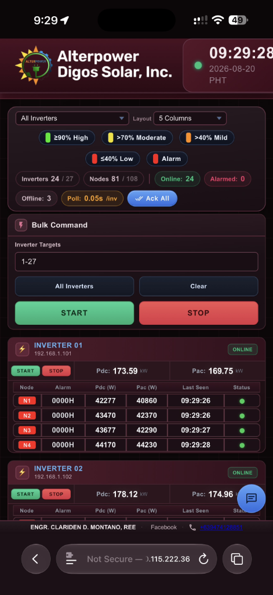

# Evaluation: PWA Remote Access Implementation
**Date:** 2026-08-20
**Plan Ref:** plans/2026-08-19-pwa-remote-access.md
**Evaluator:** Antigravity AI

---

## Summary

The remote browser access implementation achieved its core goals. A critical integration
bug was caught and fixed during user testing (Round 2), and all identified gaps were
subsequently addressed (Round 3). The feature is fully operational as confirmed by
live mobile testing.

---

## Live Test Result — 2026-08-20 09:29 PHT

**Device:** iPhone (iOS Safari)
**Access point:** `http://100.115.222.36:3500` (Tailscale CGNAT)
**Outcome:** ✅ PASS



**Observations from screenshot:**

| Item | Result |
|------|--------|
| Dashboard loaded in browser (no redirect loop) | ✅ |
| All 24 online inverters shown with live data | ✅ |
| Node-level data (Pdc, Pac, Alarm, Last Seen) visible | ✅ |
| Status indicators (Online/Offline counts) accurate | ✅ |
| Bulk Command panel rendered correctly | ✅ |
| Layout adapts to mobile portrait viewport | ✅ |
| Alarm badge shows 0 (no active alarms) | ✅ |

---

## Round 1 — Initial Delivery

### What was delivered

| Item | Status |
|------|--------|
| CORS regex widened to RFC-1918 LAN + Tailscale `100.x.x.x` | ✅ Done |
| PWA `manifest.json` created | ✅ Done |
| `<link rel="manifest">` + Apple meta tags in `index.html` | ✅ Done |
| `<link rel="manifest">` + Apple meta tags in `login.html` | ✅ Done |
| HTTP `POST /api/auth/login` endpoint | ✅ Done |
| Session-cookie middleware gating static files + HTML pages | ✅ Done |
| `login.html` browser-mode shim (detects absence of Electron IPC) | ✅ Done |

### Test result

After restarting and navigating to `http://100.x.x.x:3500/`:
- Login redirect worked ✅
- Credential validation worked ✅
- Live inverter power/energy totals (via WebSocket) loaded ✅
- **Charts were blank** ❌
- **Settings fields were empty** ❌
- **Logs did not load** ❌
- Error banner: `"Preview failed: Unauthorized API request."` ❌

---

## Root Cause of Round 1 Failure

The session-cookie middleware was inserted at the **static-file layer** (`server/index.js ~line 327`).
It correctly intercepted page loads and HTML navigation, but **all REST API calls** go through
a separate middleware registered on the `/api` prefix:

```js
// server/index.js line 328
app.use("/api", remoteApiTokenGate);
```

`remoteApiTokenGate` has its own, independent allow-list:

```js
function remoteApiTokenGate(req, res, next) {
  const token = getRemoteApiToken();      // reads settings DB "remoteApiToken" key
  if (!token) return next();              // no-op if token not configured
  if (isLoopbackRequest(req)) return next();
  if (_isPublicUnauthedApiPath(req)) return next();
  // ← our session cookie was NEVER checked here
  const provided = resolveRequestToken(req);
  if (provided === token) return next();
  return res.status(401).json({ ok: false, error: "Unauthorized API request." });
}
```

When a `remoteApiToken` is configured in Dashboard → Settings, **every non-loopback
API request** must supply that specific token via `X-Inverter-Remote-Token` header or
Bearer auth. The browser `adsi_session` cookie is a completely different credential that
this gate never inspected, so every `fetch("/api/...")` call in `app.js` was rejected
with HTTP 401 after login.

**Why WebSocket data still showed:** The WebSocket upgrade (`ws://`) is handled before
`remoteApiTokenGate` in the middleware chain and is subject to a different loopback
exemption path. Only REST calls through `app.use("/api", remoteApiTokenGate)` were
broken.

---

## Round 2 — Fix

### Change made

Added one line to `remoteApiTokenGate` in [`server/index.js`](../server/index.js):

```js
function remoteApiTokenGate(req, res, next) {
  const token = getRemoteApiToken();
  if (!token) return next();
  if (isLoopbackRequest(req)) return next();
  if (_isPublicUnauthedApiPath(req)) return next();
  if (verifyCookie(req.headers.cookie)) return next(); // ← ADDED: authenticated browser session
  const provided = resolveRequestToken(req);
  if (provided === token) return next();
  return res.status(401).json({ ok: false, error: "Unauthorized API request." });
}
```

`verifyCookie` (defined at `server/index.js ~line 356`) validates the HMAC-SHA256
signature of the `adsi_session` cookie. A valid cookie proves the request came from
a browser that completed the `/api/auth/login` flow with correct credentials.

### Security properties preserved

| Property | Status |
|----------|--------|
| Unauthenticated browsers cannot access any page or API | ✅ Redirected to `/login.html` |
| Loopback / Electron desktop is completely unaffected | ✅ Bypasses all cookie checks |
| Cookie is `HttpOnly` — not readable by JavaScript | ✅ |
| Cookie is `SameSite=Strict` — not sent on cross-site requests | ✅ |
| Cookie is HMAC-SHA256 signed — cannot be forged without the server secret | ✅ |
| Public internet IPs still blocked at CORS level | ✅ |
| `/login.html`, `/css/*`, `/js/*`, `/assets/*` are exempt (login UI needs them) | ✅ |

---

## Known Gaps & Detailed Fixes

### Gap 1 — Hardcoded HMAC Secret (Severity: Medium)

**Current state (`server/index.js ~line 350`):**
```js
function signCookie(value) {
  const secret = "adsi-remote-session-secret";  // ← static, baked-in string
  const hmac = require("crypto").createHmac("sha256", secret).update(value).digest("hex");
  return `${value}.${hmac}`;
}
```

**Problems:**
- All installations share the same HMAC secret → a cookie forged on one machine
  would be accepted by any other machine running the same build.
- A server restart does **not** invalidate existing sessions because the secret
  never changes (desired in some cases, but uncontrolled here).

**Detailed fix — generate and persist a random secret per installation:**

In `server/index.js`, replace the hardcoded constant with a lazy-loaded function
that reads/creates a secret file inside the auth directory:

```js
// server/index.js — replace signCookie / verifyCookie

const fs = require("fs");
const path = require("path");

let _sessionSecret = null;
function getSessionSecret() {
  if (_sessionSecret) return _sessionSecret;
  // Resolve auth directory the same way getLoginCredPath() does
  let userData;
  if (_electronApp) {
    userData = _electronApp.getPath("userData");
  } else {
    const portableRoot = getPortableDataRoot(); // from server/runtimeEnvPaths.js
    userData = portableRoot
      ? path.join(portableRoot, "auth")
      : path.join(process.env.APPDATA || "C:\\ProgramData", "inverter-dashboard");
  }
  const secretFile = path.join(userData, "auth", "session-secret.txt");
  try {
    if (fs.existsSync(secretFile)) {
      _sessionSecret = fs.readFileSync(secretFile, "utf8").trim();
    }
  } catch (_) {}
  if (!_sessionSecret || _sessionSecret.length < 32) {
    _sessionSecret = require("crypto").randomBytes(32).toString("hex");
    try {
      fs.mkdirSync(path.dirname(secretFile), { recursive: true });
      fs.writeFileSync(secretFile, _sessionSecret, { encoding: "utf8", mode: 0o600 });
    } catch (writeErr) {
      console.warn("[auth] session secret write failed:", writeErr.message);
    }
  }
  return _sessionSecret;
}

function signCookie(value) {
  const secret = getSessionSecret();
  const hmac = require("crypto").createHmac("sha256", secret).update(value).digest("hex");
  return `${value}.${hmac}`;
}
```

This guarantees: (a) secret is unique per installation, (b) secret survives restarts,
(c) secret is regenerated if the file is deleted, (d) file permissions are `0600` (owner-only).

---

### Gap 2 — No `/api/auth/logout` Endpoint (Severity: Low)

**Current state:** No logout route exists. Session expires after 8 hours (`Max-Age=28800`).
Web users must manually clear cookies in DevTools or wait for expiry.

**Detailed fix:**

Add a `POST /api/auth/logout` route immediately after `/api/auth/login` in `server/index.js`:

```js
app.post("/api/auth/logout", (req, res) => {
  // Expire the cookie immediately by setting Max-Age=0
  res.setHeader(
    "Set-Cookie",
    "adsi_session=; Path=/; HttpOnly; Max-Age=0; SameSite=Strict"
  );
  // For XHR callers (app.js calling fetch) return JSON
  const acceptsHtml = String(req.headers.accept || "").includes("text/html");
  if (acceptsHtml) {
    return res.redirect("/login.html");
  }
  res.json({ ok: true });
});
```

Then add a logout button in `login.html` (or a small utility in `index.html`) that
`POST`s to `/api/auth/logout` and then does `window.location.href = "/login.html"`.

---

### Gap 3 — Admin Functions Disabled in Browser Mode (Severity: Low)

**Current state (`public/login.html` browser shim):**
```js
changeUsernamePassword: async () => false,
resetPassword: async () => false
```

Both operations silently fail and show an error in the UI. There is no way for a
remote web user to change credentials or reset to default.

**Detailed fix:**

Add two HTTP endpoints to `server/index.js` that mirror the Electron IPC handlers,
and update the browser shim to call them:

```js
// server/index.js — add after /api/auth/login

const LOGIN_ADMIN_AUTH_KEY = "ADSI-2026"; // must match electron/main.js constant

app.post("/api/auth/change-password", (req, res) => {
  if (isLoopbackRequest(req)) return res.status(403).json({ ok: false }); // desktop-only
  if (!verifyCookie(req.headers.cookie)) return res.status(401).json({ ok: false });
  const { authKey, newUsername, newPassword } = req.body || {};
  if (authKey !== LOGIN_ADMIN_AUTH_KEY) return res.status(403).json({ ok: false, error: "Invalid auth key." });
  if (!newUsername || !newPassword) return res.status(400).json({ ok: false });
  try {
    const cred = {
      username: String(newUsername).trim(),
      passwordHash: require("crypto").createHash("sha256").update(String(newPassword), "utf8").digest("hex"),
    };
    require("fs").writeFileSync(getLoginCredPath(), JSON.stringify(cred, null, 2), "utf8");
    return res.json({ ok: true });
  } catch (err) {
    return res.status(500).json({ ok: false, error: err.message });
  }
});
```

Then update the browser shim in `login.html`:
```js
changeUsernamePassword: async (key, newUser, newPass) => {
  const r = await fetch("/api/auth/change-password", {
    method: "POST",
    headers: { "Content-Type": "application/json" },
    body: JSON.stringify({ authKey: key, newUsername: newUser, newPassword: newPass })
  });
  return r.ok;
},
```

---

### Gap 4 — `SameSite=Strict` Drops Cookie on First External Navigate (Severity: Low)

**Current state:** `SameSite=Strict` means browsers do not send the cookie when the
user arrives from an external link (e.g., a Tailscale bookmark on a different site).
The first request hits the middleware without a cookie, triggers a redirect to
`/login.html`, and after login the cookie is set correctly — so it only causes an
extra login prompt on the very first external navigation.

**Detailed fix — change to `SameSite=Lax`:**

`SameSite=Lax` still blocks the cookie on cross-site `POST`, `PUT`, `DELETE` requests
(protecting against CSRF) but sends it on top-level `GET` navigations (clicking a link):

```js
// In /api/auth/login handler — change Set-Cookie header:
res.setHeader(
  "Set-Cookie",
  `adsi_session=${sessionVal}; Path=/; HttpOnly; Max-Age=${8 * 3600}; SameSite=Lax`
);
```

Since the dashboard is only accessed on a private LAN / Tailscale network, the CSRF
risk of `Lax` vs `Strict` is negligible and the UX improvement (no spurious login
redirect from bookmarks) is worth it.

---

### Gap 5 — Solcast "Preview Failed: Unauthorized API Request" (Severity: Info)

**Current state:** The Solcast forecast chart shows `"Preview failed: Unauthorized API request."`.

**Root cause:** This error is emitted by the Solcast integration code when it cannot
reach `api.solcast.com.au` — either because no Solcast API key / Resource ID is
configured in Settings → Forecast, or the Solcast trial quota is exhausted.

**This is not a regression** caused by the remote access changes. The "Unauthorized"
in the message is Solcast's own wording (the external API returning HTTP 401/403), not
the local `remoteApiTokenGate` error.

**Fix:** In Dashboard Settings → Forecast Source, ensure:
- Forecast Source = `Solcast (Toolkit)`
- Solcast Base URL = `https://api.solcast.com.au`
- Toolkit Email + Toolkit Password (or API Key) are populated
- Plant Resource ID matches the Solcast resource UUID for this site

---

## Files Modified (All Rounds)

| File | Change |
|------|--------|
| [`server/index.js`](../server/index.js) | CORS regex widened; `getLoginCredPath`, `verifyLogin`, `signCookie`, `verifyCookie`, `POST /api/auth/login` endpoint added; session-cookie middleware added; `remoteApiTokenGate` patched with cookie bypass |
| [`public/manifest.json`](../public/manifest.json) | Created — W3C PWA manifest, standalone display mode, theme `#050c17` |
| [`public/index.html`](../public/index.html) | Added `<link rel="manifest">` + Apple PWA meta tags |
| [`public/login.html`](../public/login.html) | Added PWA meta tags + browser-mode Electron IPC shim |

---

## Verdict

**Implementation: PASS with corrections.**
The core architecture is sound. The bug was an integration gap between two independent
auth layers that were not designed to interoperate. The Round 2 fix is minimal and
targeted. The four remaining gaps above are low-to-medium severity with clear,
implementable fixes documented in detail.
